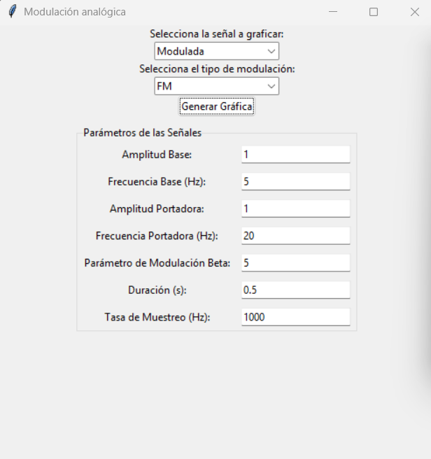
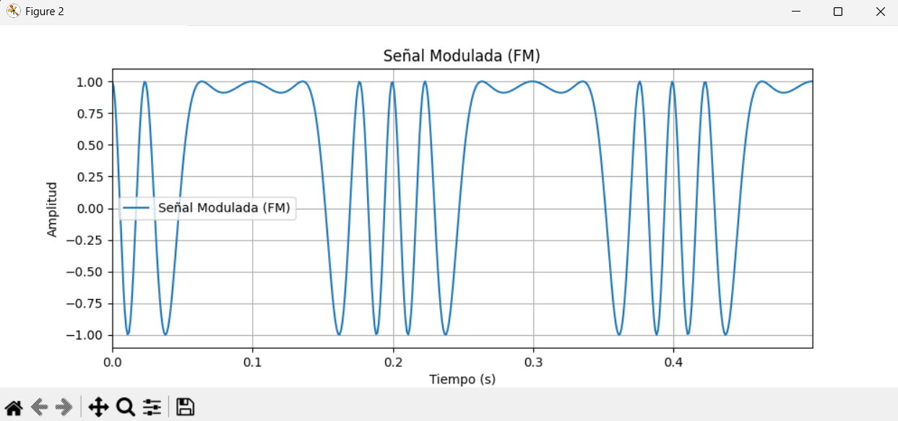
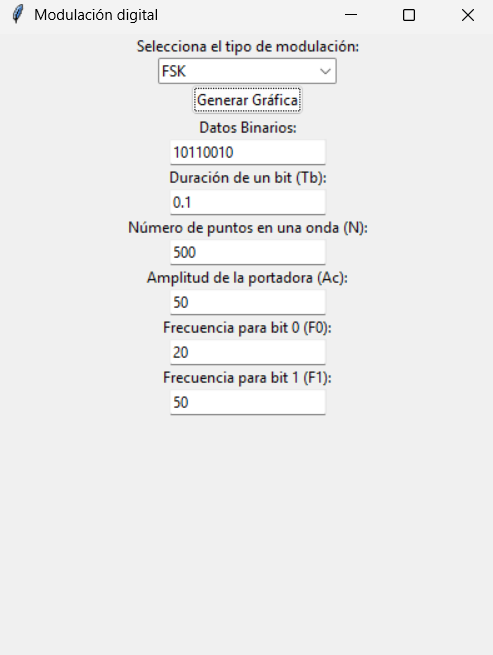
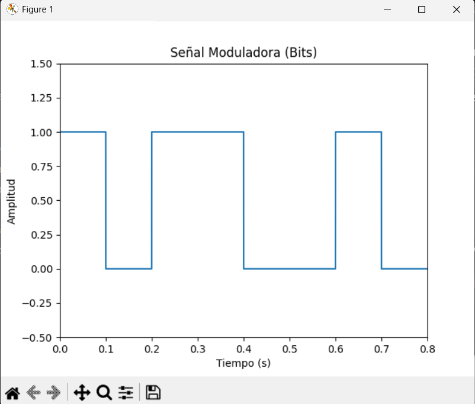
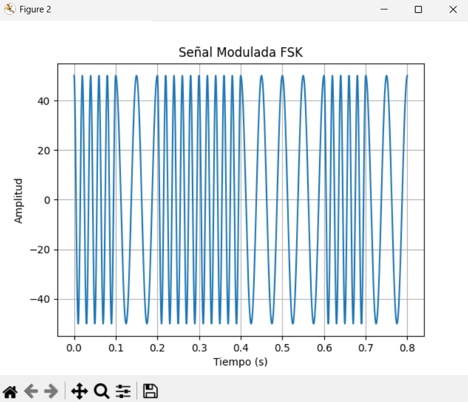

# Signal Modulation Simulator

Two desktop applications that generate and plot **analog** and **digital** carrier
modulations from user-defined parameters. Built in Python with NumPy, Tkinter and
Matplotlib as part of Telecommunications Engineering coursework.

| Application | Modulation schemes |
|---|---|
| `analog/` | AM (amplitude), FM (frequency), PM (phase) |
| `digital/` | ASK (amplitude-shift), FSK (frequency-shift), PSK (phase-shift) |

Each scheme lives in its own module exposing a single generator function; the GUI layer
only reads parameters and plots.



*Analog simulator — the Beta field appears only when FM is selected.*

---

## Running

Requires Python 3.8+ and a system with Tk available (bundled with most Python
installations; on Debian/Ubuntu: `sudo apt install python3-tk`).

```bash
git clone https://github.com/jagalarzaarias/signal-modulation-simulator.git
cd signal-modulation-simulator
pip install -r requirements.txt
```

**Analog modulations:**
```bash
cd analog
python main.py
```

**Digital modulations:**
```bash
cd digital
python main.py
```

---

## Analog simulator

Select a modulation scheme and a waveform to plot (baseband, carrier, or the modulated
result), enter the parameters, and generate the plot.

| Parameter | Symbol | Applies to |
|---|---|---|
| Baseband amplitude | `Ax` | AM, FM, PM |
| Baseband frequency (Hz) | `fx` | AM, FM, PM |
| Carrier amplitude | `Ac` | AM, FM, PM |
| Carrier frequency (Hz) | `fc` | AM, FM, PM |
| Modulation index | `beta` | FM |
| Phase deviation (rad) | — | PM |
| Duration (s) | — | all |
| Sampling rate (Hz) | — | all |

The parameter fields shown adapt to the selected scheme: `beta` only appears for FM and
the phase-deviation field only for PM, so the form never presents inputs that do not
apply.

### AM

```python
m = Ax / Ac
am_signal = (1 + m * x / Ax) * c
```

The modulation index is derived from the amplitude ratio and applied to the carrier.

### FM

```python
fm_signal = Ac * np.cos(2 * np.pi * fc * t + beta * xint)
```

Frequency modulation is implemented by adding the scaled integral of the message signal
to the carrier phase argument.

### PM

Phase modulation shifts the carrier phase proportionally to the instantaneous amplitude
of the baseband signal.



*FM output with `fx = 5 Hz`, `fc = 20 Hz`, `beta = 5`. The carrier visibly compresses and
expands as the message signal swings, which is the defining behaviour of frequency
modulation.*

---

## Digital simulator

Takes a **binary string** (e.g. `10110010`) and renders both the bit sequence and the
modulated carrier.

| Parameter | Symbol | Applies to |
|---|---|---|
| Binary data | — | all |
| Carrier frequency | `fc` | ASK, PSK |
| Carrier amplitude | `Ac` | FSK, PSK |
| Amplitude for bit 0 / bit 1 | `A0`, `A1` | ASK |
| Frequency for bit 0 / bit 1 | `F0`, `F1` | FSK |
| Bit duration | `Tb` | all |
| Samples per bit | `N` | all |

Each scheme builds the output by concatenating one bit-period waveform per input bit:

- **ASK** — switches carrier amplitude between `A0` and `A1`
- **FSK** — switches carrier frequency between `F0` and `F1`
- **PSK** — keeps amplitude and frequency constant, shifting phase by π for bit `1`

The same adaptive-form logic applies: the fields shown change with the selected scheme.



Both the baseband bit sequence and the modulated carrier are plotted, so the mapping
between the two is directly visible:

| Baseband bits | FSK output |
|---|---|
|  |  |

*Input `10110010` with `F0 = 20 Hz`, `F1 = 50 Hz`, `Tb = 0.1 s`. Each high bit produces a
visibly denser carrier segment.*

---

## Implementation notes

**Vectorized waveform generation.** All waveforms are built with NumPy array operations
over a `linspace` time vector rather than per-sample Python loops. This is what keeps
regeneration fast enough for the GUI to feel responsive when parameters change, and the
difference grows with sampling rate and signal duration.

**Modular structure.** Each modulation scheme lives in its own module exposing a single
generator function. The GUI imports them and is responsible only for reading parameters
and plotting — the signal generation has no dependency on Tkinter and could be reused
from a script or notebook unchanged.

**Bit-period concatenation.** The digital schemes precompute one carrier waveform per
symbol value and assemble the output by concatenating the appropriate one for each input
bit, rather than evaluating the carrier expression across the full signal length.

The assembly collects references in a list and concatenates **once** at the end.
Concatenating inside the loop — the obvious first implementation — reallocates and copies
the entire signal on every bit, making the cost quadratic in the number of bits. With
long bit strings and a high sample count per bit the difference is measurable.

**Shared assembly logic.** ASK, FSK and PSK differ only in the two per-symbol waveforms
they generate; the concatenation logic is identical. That logic lives in `_common.py`,
so each scheme module contains only the part that is actually specific to it.

**Input validation.** Bit strings are validated before any signal is generated, and the
GUI catches `ValueError` from both the validator and the numeric field conversions,
reporting the problem in a dialog instead of raising an unhandled exception.

---

## Possible improvements

- Embed the Matplotlib figures in the Tkinter window (`FigureCanvasTkAgg`) instead of
  opening separate plot windows
- Add a frequency-domain view (FFT) alongside the time-domain plot
- Merge both applications behind a single launcher
- Apply the same shared-logic refactor to the analog modules
- Rename identifiers to ASCII for portability across locales

---

## Stack

Python · NumPy · Matplotlib · Tkinter

**Concepts:** analog and digital carrier modulation, sampling rate and time-vector
construction, array vectorization, event-driven GUI programming
